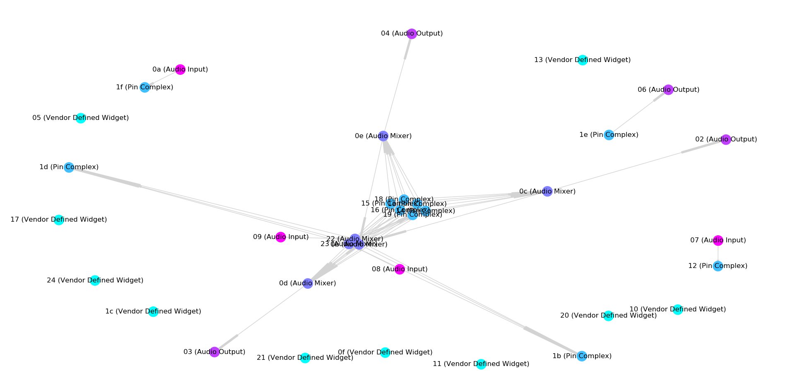

This repository contains code for debugging ALSA-related issues.

# Visualizing audio codec setup

After playing with the various debugging tools
([hda-analyzer](https://www.alsa-project.org/main/index.php/HDA_Analyzer) and
[hda-verb](https://fossies.org/linux/alsa-tools/hda-verb/README)) available in
the ALSA project, I wanted to have a more visual representation of how the
different parts of my sound system worked.

The `asound-codec-display` Python script (requires NumPy, Matplotlib and
NetworkX, tested on a 4.13 kernel) can display a nice graph of how the
different widgets inside a hardware codec are interconnected.

You can run it on debugging files exposed by ALSA in the `/proc/asound`
directory. For example, this displays a graph of codec 0 on sound card 0
(location may vary on your machine) :

    ./asound-codec-display /proc/asound/card0/codec\#0

Example output :

